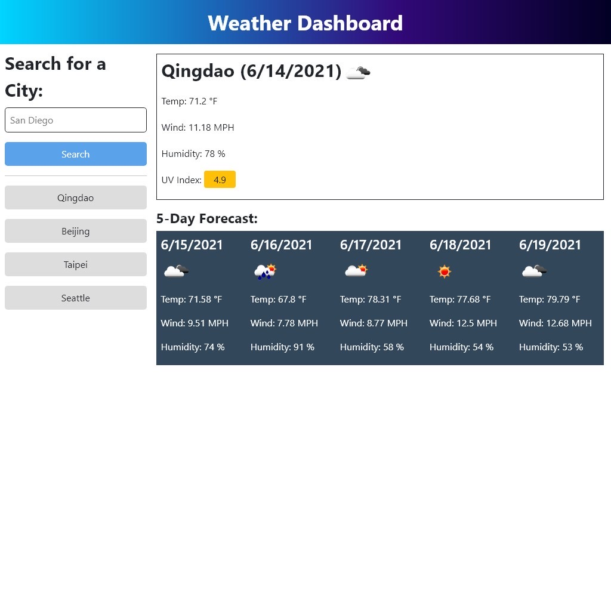

# weather-dashboard

## Description
This a web app allows user to search the weather and the forecast of cities. The app also keeps track of the past six searches made by the user and keep them stored in local storage.

## Screenshot of the Application

## Link to Deployed Application
https://ywkuo227.github.io/weather-dashboard/

## Features
- The wab app stores user search history in local storage and recalls them upon the next visit.
- The web app assesses the UV Index and color-code accordingly. 

## Credit
- Bootstrap - https://getbootstrap.com
- jQuery - https://jquery.com
- Moment - https://momentjs.com
- OpenWeather - https://openweathermap.org
